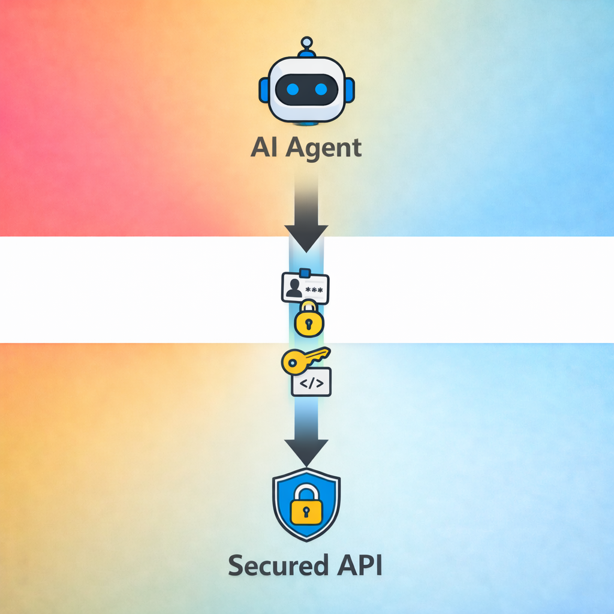
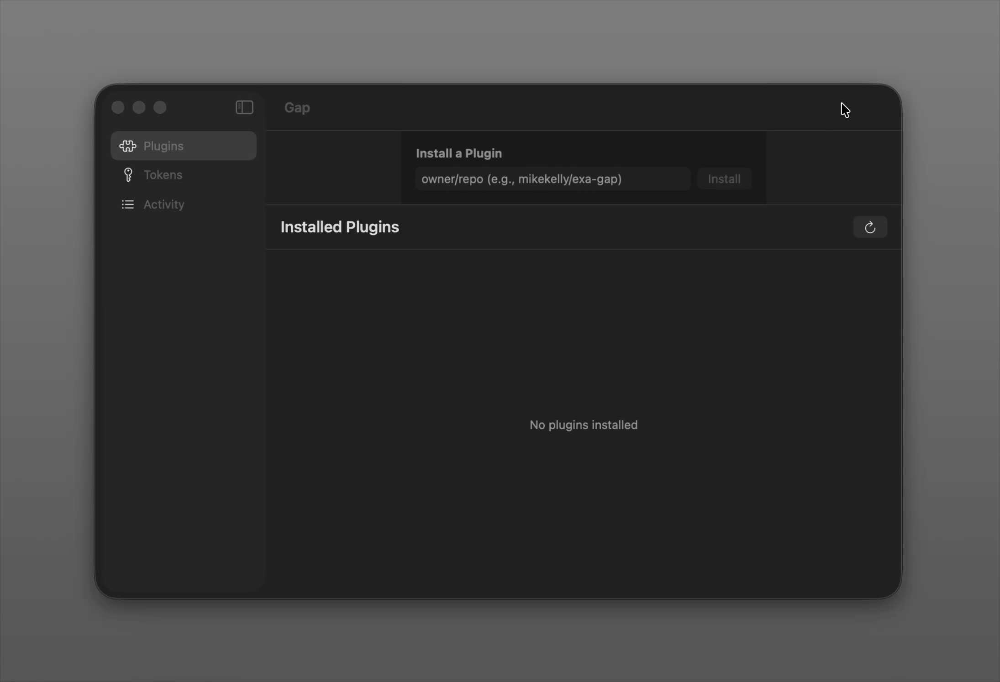
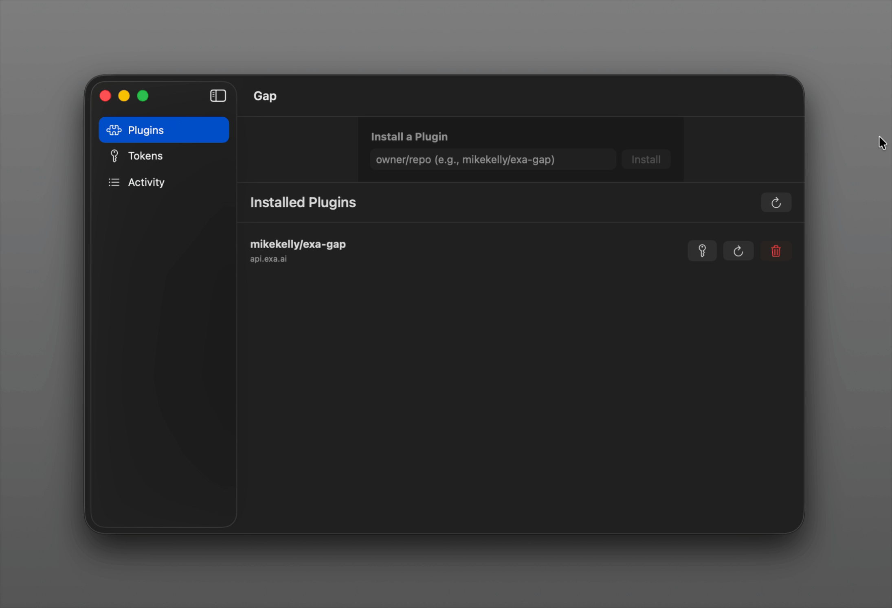
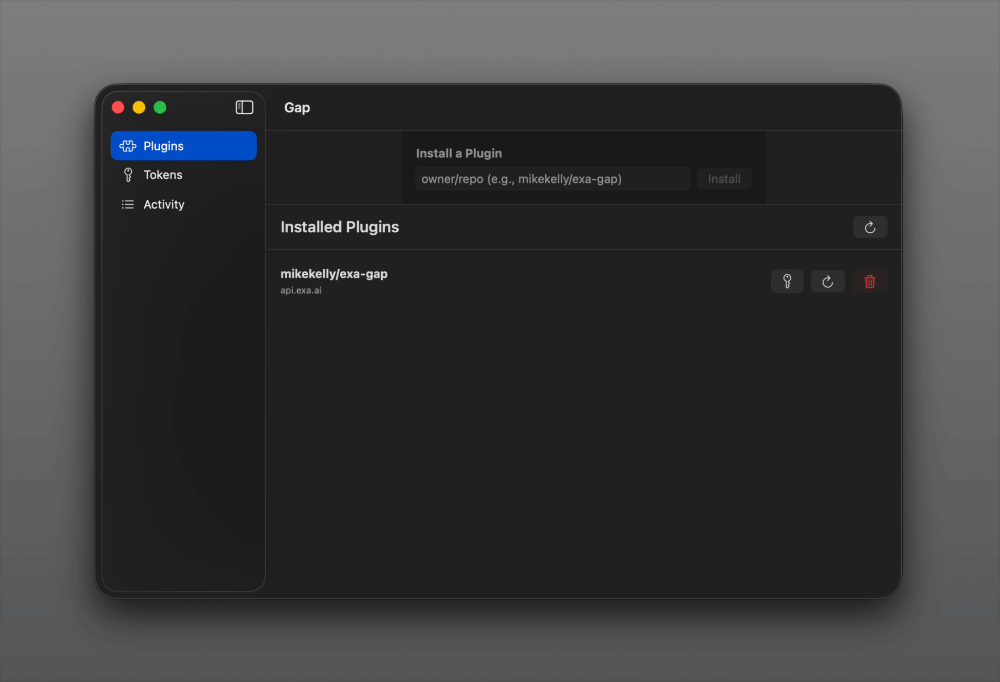

<p align="center">
  
</p>

### Give AI agents secure access to your accounts - without sharing your credentials.

## The Problem

AI agents need to access secured accounts on your behalf - manage your email, update a todo, publish something online. But how do you give them access? Today's approach is not ideal: agents are entrusted with access to API credentials - even MCPs don't keep them out of reach. 

## The Solution

Gap lets you give agents (like Claude Code, Codex, OpenClaw) access to your accounts without giving them your credentials.

Agents can only access secure APIs by going via Gap. You give them a Gap token - not your API keys. When they make a request to an API you've gapped, Gap injects your credentials for them. The agent never sees the credentials.

<p align="center">
  
</p>

**Why this matters:**
- **Prompt injection can't leak credentials** - The agent doesn't have them. A malicious prompt can't trick the agent into revealing what it doesn't possess.
- **Stolen tokens are useless off-machine** - Prompt injection could exfiltrate a Gap token, but by default the proxy is only accessible on your machine (localhost loopback).
- **Credentials are never exposed to agents** - They're encrypted using the keychain (macOS) or under a dedicated service user (Linux); inaccessible to your agents.
- **Gap can only be managed with your passcode** - To manage gap, you must know the secret you set it up with. If you don't write this down on your machine, agents can't change anything.
- **One-way credential flow** - Credentials go into Gap and never come back out. There's no API to retrieve them, no export function. The only path out is privilege escalation on your machine.
- **Monitor your agents** - By funneling access through Gap, you can monitor and record all of their interactions with your secured services. 
- **Enforce policies** - Gap can act as an enforcer of policies. Rate limit requests, restrict certain activities, require human authorisation, etc.
- **Works with any agent or software stack** - If it can use an HTTP proxy, it works with Gap. MCPs, cli tools, scripts in a skill - all of these can be easily gapped.

## Get Started

### macOS Quick Start

**Download the native app (recommended):**

1. Download `Gap.dmg` from the [latest GitHub release](https://github.com/mikekelly/gap/releases/latest)
2. Open the DMG and drag Gap to Applications
3. Launch Gap from Applications

Follow the instructions to set a password for managing your gap. **Don't store this anywhere an agent could get at it (eg. a notes app), ideally just remember it.**

Install a gap plugin for a given service (eg. Exa) and set credentials:



Set your API key:



Create a Gap token:



```bash
cd /path/to/your/project

echo "GAP_TOKEN=gap_xxxxxxxxxxxx" >> .env
```

Use gapped MCPs, CLIs, etc. like this gapped fork of exa-mcp-server:
```
claude mcp add exa -- npx -y exa-gapped-mcp
```

The agent can now talk to Exa without direct API credentials - Gap injects them automatically.

### Linux Quick Start

#### 1. Download and install binaries

```bash
# Download the latest release (adjust version and arch as needed)
curl -LO https://github.com/mikekelly/gap/releases/latest/download/gap-linux-amd64.tar.gz
tar -xzf gap-linux-amd64.tar.gz
sudo mv gap gap-server /usr/local/bin/
```

#### 2. Create a dedicated user and directories

```bash
# Create gap user (no login shell, no home directory)
sudo useradd --system --no-create-home --shell /usr/sbin/nologin gap

# Create data directory with restricted permissions
sudo mkdir -p /var/lib/gap
sudo chown gap:gap /var/lib/gap
sudo chmod 700 /var/lib/gap
```

#### 3. Create systemd service

```bash
sudo tee /etc/systemd/system/gap-server.service > /dev/null <<EOF
[Unit]
Description=Gated Agent Proxy
After=network.target

[Service]
Type=simple
User=gap
Group=gap
Environment=GAP_DATA_DIR=/var/lib/gap
ExecStart=/usr/local/bin/gap-server
Restart=on-failure
RestartSec=5

# Security hardening
NoNewPrivileges=yes
ProtectSystem=strict
ProtectHome=yes
PrivateTmp=yes
ReadWritePaths=/var/lib/gap

[Install]
WantedBy=multi-user.target
EOF
```

#### 4. Start the service

```bash
sudo systemctl daemon-reload
sudo systemctl enable gap-server
sudo systemctl start gap-server

# Check status
sudo systemctl status gap-server
```

#### 5. Initialize and configure

```bash
# Initialize with a password
gap init

# Install a plugin
gap install mikekelly/exa-gap

# Set your API key
gap set mikekelly/exa-gap:apiKey

# Create a token for your agent
gap token create my-agent
```

### Docker (for containerized agents)

> **Security note:** The Docker deployment is designed for environments where **agents also run in containers**. If your agent runs directly on the host machine, use the native macOS/Linux installation instead - a host-based agent could potentially access the Docker volume and read credentials directly, bypassing the proxy's protection.

The Docker image is ideal for:
- Sandboxed agent environments (agent and Gap both containerized)
- Kubernetes deployments
- CI/CD pipelines with ephemeral agents

#### Quick start

```bash
# Run with persistent storage (required)
docker run -d \
  --name gap-server \
  -v gap-data:/var/lib/gap \
  -p 9443:9443 \
  -p 9080:9080 \
  mikekelly321/gap:latest
```

#### Example Docker Compose

```yaml
services:
  gap-server:
    image: mikekelly321/gap:latest
    volumes:
      - gap-data:/var/lib/gap
      # Export CA cert so agents can trust it
      - ./gap-ca.crt:/var/lib/gap/ca-export.crt:ro
    ports:
      - "9443:9443"
      - "9080:9080"
    networks:
      - agent-network

  my-agent:
    image: your-agent-image
    environment:
      # Proxy uses HTTPS, not HTTP
      - HTTPS_PROXY=https://gap-server:9443
      # Agent needs to trust Gap's CA for both proxy and MITM
      - NODE_EXTRA_CA_CERTS=/certs/ca.crt
      - GAP_TOKEN=${GAP_TOKEN}
    volumes:
      # Mount CA cert from host
      - ./gap-ca.crt:/certs/ca.crt:ro
    networks:
      - agent-network
    depends_on:
      - gap-server

volumes:
  gap-data:

networks:
  agent-network:
```

#### Volume requirement

The container **requires** a volume mount for `/var/lib/gap`. Without it, secrets would be lost when the container stops:

```bash
# This will fail with a helpful error
docker run mikekelly321/gap:latest

# For testing only, you can bypass with:
docker run -e GAP_ALLOW_EPHEMERAL=I-understand-secrets-will-be-lost mikekelly321/gap:latest
```

### Build from Source

#### 1. Build and start the server

```bash
git clone https://github.com/mikekelly/gap.git
cd gap
cargo build --release

# Start the server
./target/release/gap-server &
```

#### 2. Initialize and install a plugin

```bash
# Initialize with a password (you'll need this for admin operations)
./target/release/gap init

# Install the Exa search plugin
./target/release/gap install mikekelly/exa-gap

# Set your Exa API key
./target/release/gap set "mikekelly/exa-gap:apiKey"
```

## How It Works

1. **Agent makes request** through the proxy with its bearer token
2. **Gap authenticates** the agent and checks which plugins it can use
3. **Plugin matches** the target hostname (e.g., `api.exa.ai`)
4. **Credentials loaded** from secure storage
5. **JavaScript transform** injects credentials into the request
6. **Request forwarded** to the actual API

### Security Model

Credentials are **write-only** and **stored outside your user context**:
- **macOS**: Stored encrypted using a key in the Keychain, isolated from user-space processes
- **Linux**: Stored with restricted permissions under a dedicated service user

There's no "get credential" API, no way to list credential values, no export function. The only way to use a credential is through the proxy - and the only way to extract one is privilege escalation to root/admin.

This is a fundamentally different security posture than giving credentials to an agent, where a single prompt injection could exfiltrate them to an attacker-controlled server.

**Agent tokens:** Tokens are for **tracking and audit**, not strong authentication. Any process that can read the token (other agents, scripts, humans with shell access) can use it. The real security boundary is the credential store - tokens just help you try and keep track of which agent made which request.

Plugins are simple JavaScript:

```javascript
export default {
  name: "exa-gap",
  match: ["api.exa.ai"],

  credentialSchema: {
    fields: [
      { name: "apiKey", label: "API Key", type: "password", required: true }
    ]
  },

  transform(request, credentials) {
    request.headers["Authorization"] = `Bearer ${credentials.apiKey}`;
    return request;
  }
};
```

## Common Questions

**Q: Can a malicious agent steal my credentials?**

No. The agent never receives your credentials - they're injected at the network layer. Even a compromised agent can only make requests to APIs you've authorized, and you'll see the activity in your logs.

**Q: What if someone steals the agent token?**

Agent tokens control which APIs can be accessed, but not which credentials are used. A stolen token lets someone make requests on your behalf to authorized APIs - similar to API key theft, but scoped to specific services. You can revoke tokens instantly via `gap token delete`.

**Q: How is this different from giving my API keys to the agent?**

With Gap: credentials stay in secure storage, agent gets scoped access via token, you control which APIs, you can revoke instantly.

**Q: Can I use this with Claude Code, Cursor, or other IDEs?**

Yes, if the IDE supports HTTPS proxy configuration. The proxy uses **HTTPS on port 9443** (not HTTP). Point it to `https://localhost:9443` and configure the IDE to trust Gap's CA certificate at:
- **macOS:** `~/Library/Application Support/gap/ca.crt`
- **Linux:** `/var/lib/gap/ca.crt`

Each IDE has different proxy settings - check their documentation.

**Note:** The proxy uses TLS 1.3 with post-quantum key exchange (X25519MLKEM768). macOS system curl (LibreSSL-based) may not be compatible; use an OpenSSL-based curl if needed.

**Q: Do I need to trust the agent framework?**

You need to trust it not to exfiltrate data it receives from APIs (like search results), but you don't need to trust it with your credentials. The agent never sees them.

## Contributing

Contributions welcome! See the codebase structure:

- `gap-lib/` - Core library (proxy, plugins, storage)
- `gap-server/` - Server daemon
- `gap/` - CLI tool

```bash
cargo test        # Run tests
cargo clippy      # Lint
```

## License

MIT
